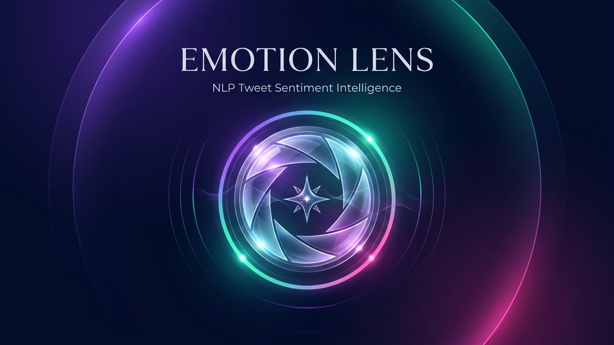

<p align="center">
  
</p>

# Emotion Lens — Tweet Sentiment Analysis

<p align="left">
  
  <strong>Emotion Lens</strong> is an interactive machine learning dashboard that classifies short, tweet-like text into <strong>Positive</strong> or <strong>Negative</strong> sentiment using a TF-IDF vectorizer and a Linear SVM model. Designed and maintained by <strong>Deepak Polisetti</strong>.
</p>

<br>

<p align="left">
  <a href="https://emotion-lens-model.vercel.app"></a>
  
  <a href="LICENSE"></a>
</p>

> **Live demo:** [https://emotion-lens-model.vercel.app](https://emotion-lens-model.vercel.app)  
> **Bookmark & Shortcut:** Supports full Chrome bookmarks, desktop shortcuts, Android/iOS home screen icons, and Open Graph social sharing previews.

## Highlights

- Live JSON API and responsive, accessible web interface.
- Binary sentiment prediction with a decision score and confidence proxy.
- Recorded held-out test accuracy of **81.6%** on the saved Sentiment140 evaluation.
- Dashboard metrics and influential words loaded from the actual saved training output.
- Deployable straight away: the trained model and the small dashboard assets are included in the repository.

## Tech stack

Python · Flask · scikit-learn · TF-IDF · LinearSVC · HTML/CSS/JavaScript · Vercel

## Run locally

Prerequisite: Python 3.10 or later.

```powershell
python -m venv .venv
.\.venv\Scripts\Activate.ps1
pip install -r requirements.txt
python app.py
```

Open `http://127.0.0.1:5000` in your browser.

## API

| Endpoint | Method | Purpose |
| --- | --- | --- |
| `/` | `GET` | Web dashboard |
| `/api/metrics` | `GET` | Saved held-out evaluation metrics |
| `/api/top-terms` | `GET` | High-weight positive and negative model terms |
| `/api/predict` | `POST` | Classify JSON such as `{ "text": "I love this!" }` |

## Train the model again

The deployed app does not need the raw training corpus. To rerun the complete training and evaluation workflow locally, install the training dependencies and run the project script:

```powershell
pip install -r requirements-training.txt
.\run_project.ps1
```

Raw and processed Sentiment140 data, large prediction exports, image outputs, logs, and virtual environments are intentionally excluded from Git. The committed `models/tweet_sentiment_tfidf_svm.joblib`, `outputs/metrics.json`, and `outputs/top_weighted_terms.csv` are the small runtime assets required by the demo.

## Dataset and responsible use

The model was trained on the Sentiment140 corpus. Its labels are distant-supervision labels inferred from emoticons rather than human judgements. It is a portfolio/learning project and should not be used to make consequential decisions about people or groups.

## License and ownership

Copyright © 2026 Deepak Polisetti. Released under the [MIT License](LICENSE).
