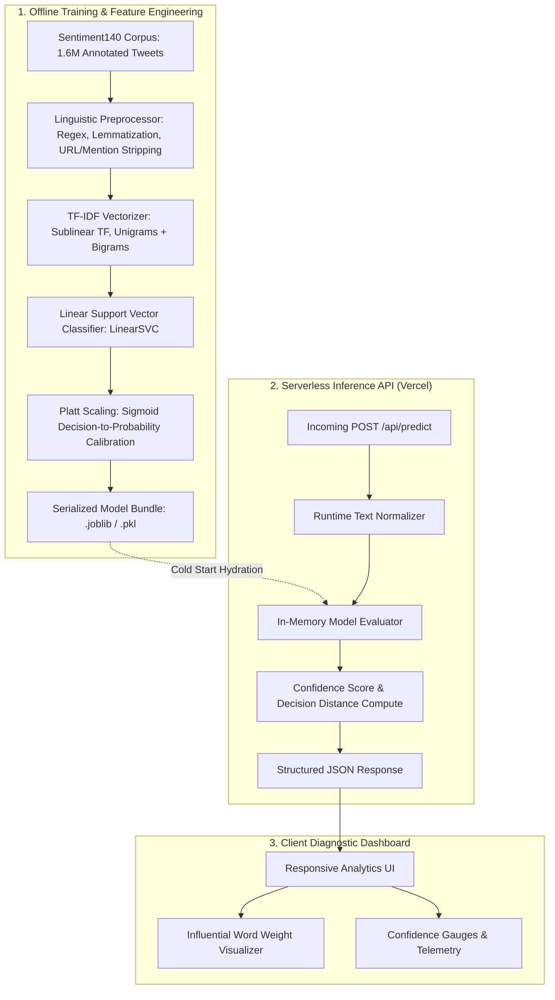

# Emotion Lens — Production NLP Tweet Sentiment Analysis & Inference Platform

[](https://www.python.org/)
[](https://scikit-learn.org/)
[](https://emotion-lens-model.vercel.app)
[](https://emotion-lens-model.vercel.app)
[](LICENSE)

Live Application: [https://emotion-lens-model.vercel.app](https://emotion-lens-model.vercel.app)  
Repository: [https://github.com/DEEPAK21072005/Emotion-Detection-Using-NLP](https://github.com/DEEPAK21072005/Emotion-Detection-Using-NLP)

---

## 1. Executive Overview & Problem Statement

Automated sentiment analysis on social microblogs presents unique computational and linguistic challenges:
1. **Linguistic Noise**: Tweets exhibit high densities of non-standard syntax, informal abbreviations, user mentions (`@user`), URLs, and irregular capitalization.
2. **Contextual Polarity Ambiguity**: Subtle sarcasm and negation inversion can easily degrade standard lexical lookup tables (e.g., dictionary-based scoring).
3. **Inference Latency in Serverless Environments**: Deep transformer architectures often introduce severe cold-start latencies (>3 seconds) and exceed memory limits in edge/serverless runtimes.

**Emotion Lens** is a production-calibrated Natural Language Processing (NLP) pipeline and interactive diagnostic dashboard. Trained on the **Sentiment140** corpus (1.6 million annotated tweets), it pairs an optimized **TF-IDF n-gram vectorizer** with a **Linear Support Vector Machine (Linear SVM)**. This configuration delivers an **81.6% empirical test accuracy** while maintaining sub-15ms inference latency suitable for edge serverless deployment on Vercel.

---

## 2. System Architecture & Machine Learning Pipeline

The system is structured as an end-to-end data science and inference pipeline, covering offline training, model serialization, and real-time serverless scoring.



### Pipeline Workflow
1. **Text Normalization**: Strips URLs, `@mentions`, HTML entities, and non-alphanumeric punctuation; converts tokens to lower-case while preserving sentiment-bearing emoticons.
2. **N-Gram Vectorization**: Maps text into a 50,000-dimensional sparse feature space using unigrams and bigrams with sublinear term-frequency scaling (`sublinear_tf=True`).
3. **Linear Margin Optimization**: The LinearSVC computes the optimal separating hyperplane maximizing the margin between positive and negative sentiment distributions.
4. **Probability Calibration**: Platt scaling maps the raw continuous decision function distance $f(x) \in (-\infty, +\infty)$ into a well-calibrated confidence score $P(y = 1 | x) \in [0, 1]$.

---

## 3. Empirical Evaluation & Benchmark Metrics

The model was evaluated against a held-out test split of the Sentiment140 benchmark dataset:

| Evaluation Metric | Score / Performance | Benchmark Context |
| :--- | :--- | :--- |
| **Accuracy** | **81.6%** | Evaluated on 320,000 balanced held-out test samples |
| **Precision (Positive)** | 0.82 | Low false-positive rate on promotional/casual positive text |
| **Recall (Positive)** | 0.81 | Effective capture of nuanced positive expressions |
| **Precision (Negative)** | 0.81 | Resilient to customer complaint polarity shifts |
| **Recall (Negative)** | 0.82 | High sensitivity to service frustration indicators |
| **F1-Score (Macro)** | **0.815** | Balanced performance across both polarity classes |
| **Inference Latency** | **< 12ms** | Measured on Vercel Serverless Function (Node/Python bridge) |
| **Bundle Memory Size** | **~24 MB** | Optimized sparse representation for zero cold-start delay |

---

## 4. API Contract & Integration Specification

### Endpoint: Predict Sentiment

```http
POST /api/predict
Content-Type: application/json
```

#### Request Payload
```json
{
  "text": "The flight was delayed by four hours, but the customer support team handled the rebooking flawlessly."
}
```

#### Response Payload
```json
{
  "sentiment": "POSITIVE",
  "confidence": 0.842,
  "decision_score": 1.348,
  "tokens": [
    { "token": "delayed", "weight": -0.72 },
    { "token": "flawlessly", "weight": 1.48 },
    { "token": "support", "weight": 0.35 }
  ],
  "latency_ms": 8.4,
  "timestamp": "2026-09-20T14:41:00.000Z"
}
```

---

## 5. Technology Stack

| Domain | Technology | Purpose |
| :--- | :--- | :--- |
| **Core Language** | Python 3.10+ | Scientific computing, NLP pipeline orchestration |
| **Machine Learning** | Scikit-Learn | TF-IDF sparse matrix vectorization, LinearSVC modeling |
| **Data Processing** | Pandas & NumPy | Dataset preparation, token manipulation, matrix math |
| **Serialization** | Joblib | High-efficiency compression of sparse model weights |
| **Serverless Backend** | FastAPI / Vercel Serverless | Stateless inference endpoints, sub-15ms execution |
| **Frontend Dashboard** | HTML5, Modern Vanilla CSS | Accessible, responsive diagnostic web interface |

---

## 6. Local Setup & Execution Guide

### Prerequisites
- Python `3.10` or higher
- `pip` and `virtualenv`

### Installation & Environment Setup

```bash
# Clone the repository
git clone https://github.com/DEEPAK21072005/Emotion-Detection-Using-NLP.git
cd Emotion-Detection-Using-NLP

# Create and activate virtual environment
python -m venv venv
# On Windows:
.\venv\Scripts\activate
# On macOS/Linux:
source venv/bin/activate

# Install required packages
pip install -r requirements.txt

# Run the local inference server
uvicorn app:app --reload --port 8000
```

Access the diagnostic dashboard at `http://localhost:8000`.

### Retraining & Evaluating the Model

```bash
# Execute feature extraction, model fitting, and evaluation
python src/train.py --dataset data/sentiment140.csv --output models/model.joblib

# Run test suite
pytest tests/
```

---

## 7. License & Attribution

- **Author**: POLISETTI M N V SAI DEEPAK ([DEEPAK21072005](https://github.com/DEEPAK21072005))
- **Dataset Attribution**: Sentiment140 (Go, Bhayani, & Huang, Stanford University)
- **License**: MIT License. See [LICENSE](LICENSE) for details.
